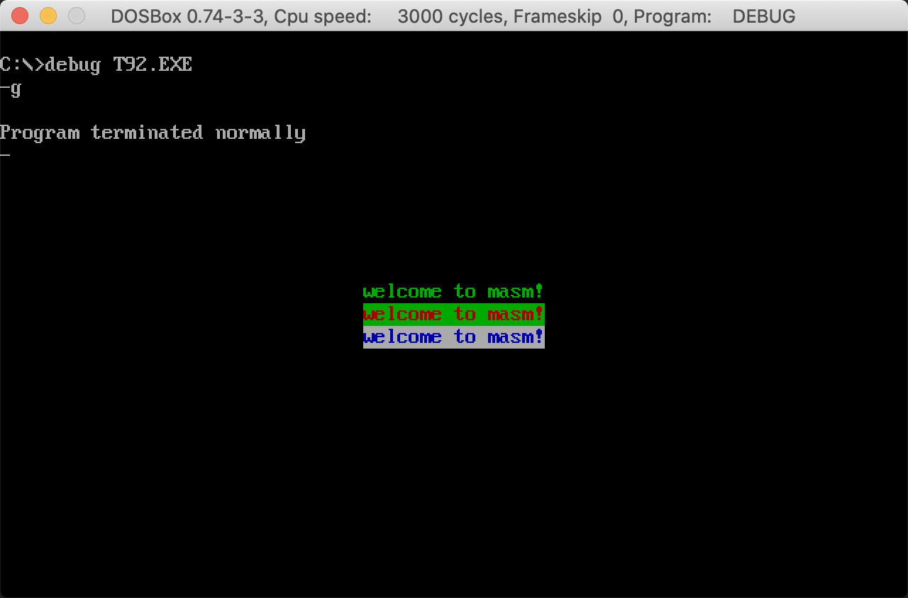

# Assembly-Learning
**参考书：** 《汇编语言》第四版，王爽



# 环境
使用工具：
- DOSBOX 0.74-3-3
- **masm.exe**
- link.exe
- debug.exe

本人操作系统是 MacOS，故下载 DOSBOX for mac

# MacOS 下使用 DOSBOX 的方法：

官网下载：https://www.dosbox.com/wiki/DOSBox_and_Mac_OS_X

下载完后，把 dmg 里面的文件复制到一个文件夹里，然后运行 DOSBox 即可。

找到 DOSBox 配置文件，注 Library 中文是资源库，后面 DOSBox 版本与你下载版本有关。（**务必第一次运行 DOSBOX，才有配置文件**）

```
/Users/your_name/Library/Preferences/DOSBox 0.74-3-3 Preferences
```

在 `[autoexec]` 下面配置即可愉快玩耍！之后需要将 `masm.exe`、`link.exe`、`debug.exe` 放在配置的路径下即可使用。

```
mount c ~/Desktop/masm
 c:
```

## 全屏 DOSBOX in Mac

`option + Enter` 全屏

---

# 使用批处理快速进行编译、连接、删除操作

具体细节参考代码 `make.bat`

## 使用方法：

需将文件放置在 `[autoexec]` 配置路径下 `\exp` 文件中，并以 `xxx.asm` 格式命名，使用时忽略 `.asm`，输入文件名即可。

```
make xxx    // 编译、链接生成可执行文件
```

删除 `[autoexec]` 目录下所有 `.obj`、`.exe` 文件。

```
make clean  // 删除产生的文件
```

之后每次只需要在 `\exp` 中保存源代码，先 `make clean` 后 `make xxx`，最后 `debug xxx` 即可快速测试。

若有需要，可自行修改 `make.bat` 中的路径以自定义自己的路径。

